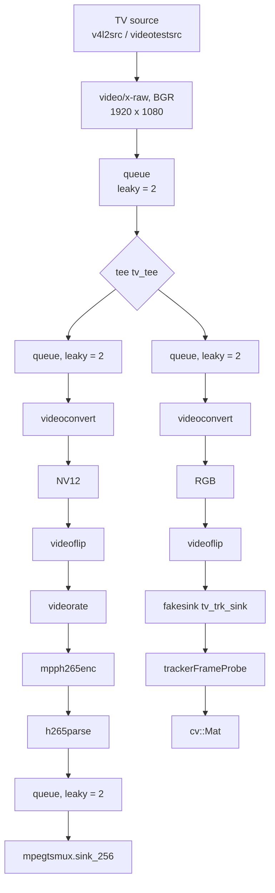
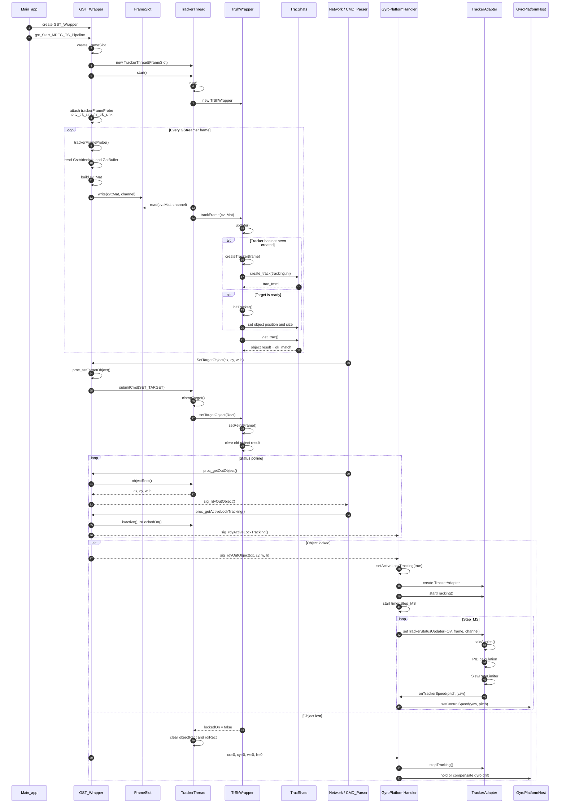
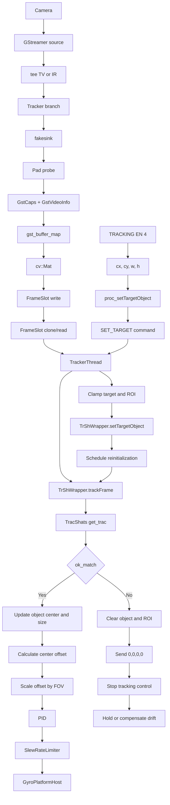

# Workflow of the tracking subsystem

## TV camera pipeline

```mermaid
flowchart TD
    SRC["TV source<br/>v4l2src / videotestsrc"] --> VCAPS["video/x-raw, BGR<br/>1920 x 1080"]
    VCAPS --> Q1["queue<br/>leaky = 2"]
    Q1 --> TEE{"tee tv_tee"}

    TEE --> EQ["queue, leaky = 2"]
    EQ --> CVT["videoconvert"]
    CVT --> NV12["NV12"]
    NV12 --> FLIP1["videoflip"]
    FLIP1 --> VRATE["videorate"]
    VRATE --> ENC["mpph265enc"]
    ENC --> H265["h265parse"]
    H265 --> EQ2["queue, leaky = 2"]
    EQ2 --> MUX["mpegtsmux.sink_256"]

    TEE --> TQ["queue, leaky = 2"]
    TQ --> CVT2["videoconvert"]
    CVT2 --> RGB["RGB"]
    RGB --> FLIP2["videoflip"]
    FLIP2 --> FS["fakesink tv_trk_sink"]
    FS --> TP["trackerFrameProbe"]
    TP --> MAT["cv::Mat"]
```

## Tracker objects and calls

```mermaid
sequenceDiagram
    autonumber
    participant Main as Main_app
    participant GST as GST_Wrapper
    participant Slot as FrameSlot
    participant Thread as TrackerThread
    participant Wrap as TrShWrapper
    participant Alg as TracShats
    participant Net as Network / CMD_Parser
    participant GPH as GyroPlatformHandler
    participant Adapter as TrackerAdapter
    participant GSP as GyroPlatformHost

    Main->>GST: create GST_Wrapper
    Main->>GST: gst_Start_MPEG_TS_Pipeline

    GST->>GST: create FrameSlot
    GST->>Thread: new TrackerThread(FrameSlot)
    GST->>Thread: start()
    Thread->>Thread: run()
    Thread->>Wrap: new TrShWrapper

    GST->>GST: attach trackerFrameProbe<br/>to tv_trk_sink / ir_trk_sink
    loop Every GStreamer frame
        GST->>GST: trackerFrameProbe()
        GST->>GST: read GstVideoInfo and GstBuffer
        GST->>GST: build cv::Mat
        GST->>Slot: write(cv::Mat, channel)
        Thread->>Slot: read(cv::Mat, channel)
        Thread->>Wrap: trackFrame(cv::Mat)
        Wrap->>Wrap: update()

        alt Tracker has not been created
            Wrap->>Wrap: createTracker(frame)
            Wrap->>Alg: create_track(tracking.ini)
            Alg-->>Wrap: trac_tmml
        end

        alt Target is ready
            Wrap->>Wrap: initTracker()
            Wrap->>Alg: set object position and size
        end

        Wrap->>Alg: get_trac()
        Alg-->>Wrap: object result + ok_match
    end

    Net->>GST: SetTargetObject(cx, cy, w, h)
    GST->>GST: proc_setTargetObject()
    GST->>Thread: submitCmd(SET_TARGET)
    Thread->>Thread: clampTarget()
    Thread->>Wrap: setTargetObject(Rect)
    Wrap->>Wrap: setReinitFrame()
    Wrap->>Wrap: clear old object result

    loop Status polling
        Net->>GST: proc_getOutObject()
        GST->>Thread: objectRect()
        Thread-->>GST: cx, cy, w, h
        GST-->>Net: sig_rdyOutObject()

        Net->>GST: proc_getActiveLockTracking()
        GST->>Thread: isActive(), isLockedOn()
        GST-->>GPH: sig_rdyActiveLockTracking()
    end

    alt Object locked
        GST-->>GPH: sig_rdyOutObject(cx, cy, w, h)
        GPH->>GPH: setActiveLockTracking(true)
        GPH->>Adapter: create TrackerAdapter
        GPH->>Adapter: startTracking()
        GPH->>GPH: start timer Step_MS

        loop Step_MS
            GPH->>Adapter: setTrackerStatusUpdate(FOV, frame, channel)
            Adapter->>Adapter: calcAngles()
            Adapter->>Adapter: PID calculation
            Adapter->>Adapter: SlewRateLimiter
            Adapter->>GPH: onTrackerSpeed(pitch, yaw)
            GPH->>GSP: setControlSpeed(yaw, pitch)
        end
    else Object lost
        Wrap-->>Thread: lockedOn = false
        Thread->>Thread: clear objectRect and roiRect
        GST-->>GPH: cx=0, cy=0, w=0, h=0
        GPH->>Adapter: stopTracking()
        GPH->>GSP: hold or compensate gyro drift
    end
```

## Frame acquisition and tracker decision

```mermaid
flowchart TD
    C0["Camera"] --> C1["GStreamer source"]
    C1 --> C2["tee TV or IR"]
    C2 --> C3["Tracker branch"]
    C3 --> C4["fakesink"]
    C4 --> C5["Pad probe"]
    C5 --> C6["GstCaps + GstVideoInfo"]
    C6 --> C7["gst_buffer_map"]
    C7 --> C8["cv::Mat"]
    C8 --> C9["FrameSlot write"]
    C9 --> C10["FrameSlot clone/read"]
    C10 --> C11["TrackerThread"]

    CMD["TRACKING EN 4"] --> CMD1["cx, cy, w, h"]
    CMD1 --> CMD2["proc_setTargetObject"]
    CMD2 --> CMD3["SET_TARGET command"]
    CMD3 --> C11
    C11 --> C12["Clamp target and ROI"]
    C12 --> C13["TrShWrapper.setTargetObject"]
    C13 --> C14["Schedule reinitialization"]

    C11 --> C15["TrShWrapper.trackFrame"]
    C14 --> C15
    C15 --> C16["TracShats get_trac"]
    C16 --> C17{"ok_match"}

    C17 -->|Yes| C18["Update object center and size"]
    C18 --> C19["Calculate center offset"]
    C19 --> C20["Scale offset by FOV"]
    C20 --> C21["PID"]
    C21 --> C22["SlewRateLimiter"]
    C22 --> C23["GyroPlatformHost"]

    C17 -->|No| C24["Clear object and ROI"]
    C24 --> C25["Send 0,0,0,0"]
    C25 --> C26["Stop tracking control"]
    C26 --> C27["Hold or compensate drift"]
```
